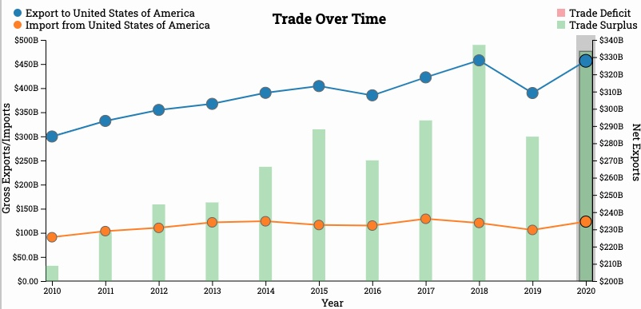
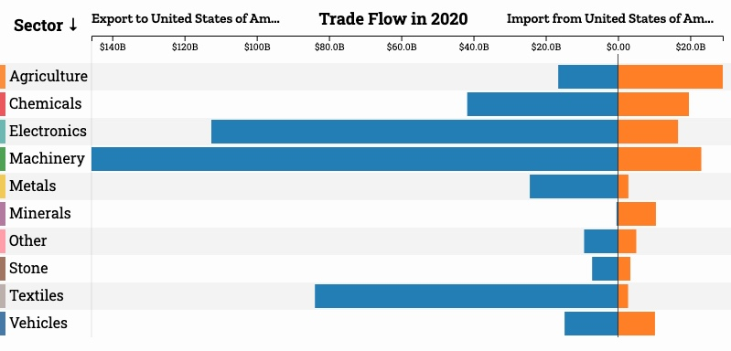
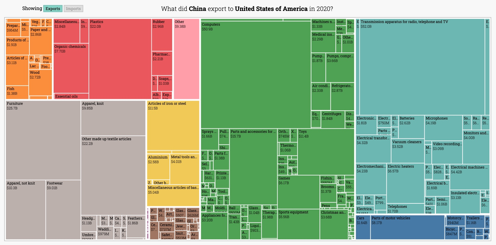
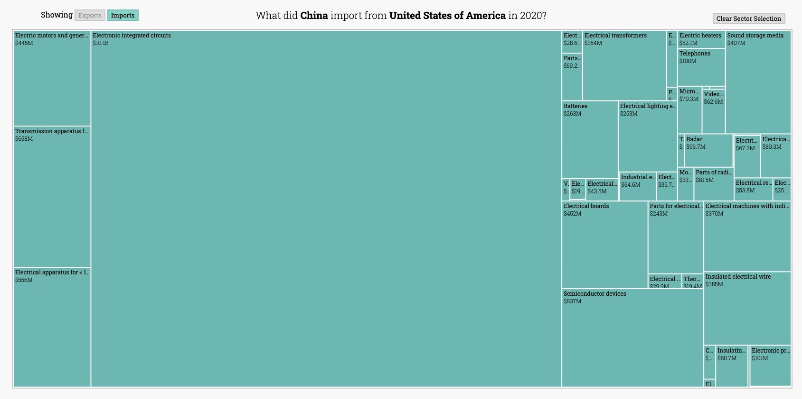

# Commerce Among Nations

**A Bilateral Trade Data Visualization and Exploration Tool**

Authors: Andrew Lee, Franklin Yuan


> Please view this web application on Chrome for the best experience.


- Project Website: [Commerce Among Nations](https://candrewlee14.github.io/data-viz-project/) 

- Screencast Video: [YouTube](https://youtu.be/OXdyF8Prxyw)

- Process book: 

- Dataset: [Atlas of Economic Complexity Dataverse](https://dataverse.harvard.edu/dataverse/atlas)

## Project Structure

Directories and files that are worth mentioning:

```bash
data-viz-project/
├ docs/
├ src/
│ ├ components/
│ │ ├ BarChart.svelte
│ │ ├ LineChart.svelte
│ │ └ TreeMap.svelte
│ ├ global/
│ │ └ store.ts
│ ├ models/
│ │ └ models.ts
│ └ routes/
│   └ +page.svelte
├ static/
│ └ data/
└ python-scripts/
```

`docs` contains all of the documentation, including our Process Book, in PDF format

`src` contains the source files used to build the web application:

* `components/BarChart.svelte`  builds `Trade Flow` diverging bar chart 

* `components/LineChart.svelte` builds `Trade Over Time` bar-line chart

* `components/TreeMap.svelte` builds the drill down treemap 

* `global/store.ts` stores all of the global `Writable` variables

* `models/models.ts` stores all of the data models

* `routes/page.svelte` component builds the main page of the web application

`static` contains all static assets:

* `data`  contains all of the CSV files used by the visualization components

`python-scripts` contains helper scripts used during data wrangling

## Installation

> Note: This project uses `Node@v19.0.0`

```bash
# install all dependencies
npm install

# start the server and open the app in a new browser tab
npm run dev -- --open
```

## Features

### Trade Over Time

* The Bar-line Chart displays the bilateral trade history between 2010 and 2020. It combines a line chart that plots the country's gross exports and imports with its trade partner and a bar chart that shows the two countries' bilateral trade balance.

* You can select a range of years through a 1-dimensional brush.



### Trade Flow

* The Diverging Bar Chart breaks down the bilateral trade into 10 major product sectors and shows sector-specific trade flow in a given year or a range of years.

* You can sort the sectors by name, exports, imports or total trade in both ascending and decending order. 

* You can filter and display specific sectors by clicking on their tabs.

 

### Exports/Imports By Product

* The Tree Map displays a further breakdown of exports or imports by product in a given year or a range of years.



* You can aslo isolate and display products from a specific sector by clicking anywhere within that product sector on the tree map.


