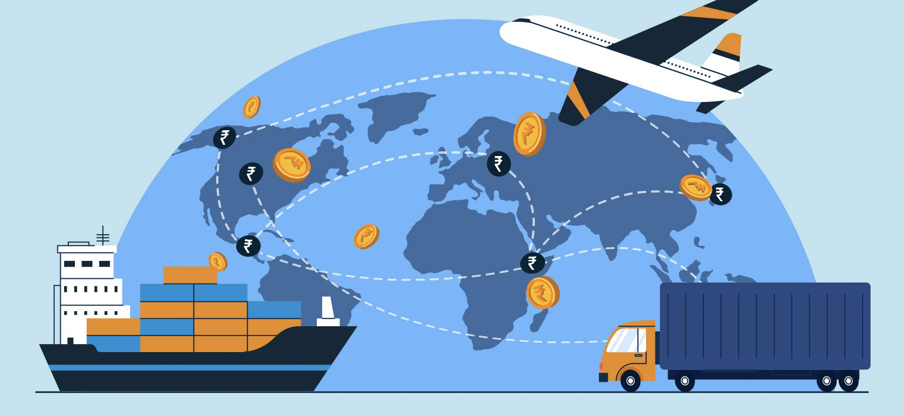

# Visualizing Bilateral Trade Between Countries

*Authors: Andrew Lee, Franklin Yuan*



## Process Book
Google Doc [link](https://docs.google.com/document/d/1ym9aAKeQHBe1OTCFG1JeLSgSWCZnzHSTmUCR-wCfH_4/edit?usp=sharing).

## How to View the App

Once you've installed dependencies with `npm install` (or `pnpm install` or `yarn`), start a development server:

```bash
npm run dev

# or start the server and open the app in a new browser tab
npm run dev -- --open
```

## Building

To create a production version of the app:

```bash
npm run build
```

You can preview the production build with `npm run preview`.

> To deploy your app, you may need to install an [adapter](https://kit.svelte.dev/docs/adapters) for your target environment.